# Внутреннее устройство Universal Skill Importer

Это подробный справочник для разработчиков и агентов, которые будут сопровождать реализацию.
Короткое product-описание для техлида находится в
[`TECH_LEAD_IMPORTER_ALGORITHM.md`](TECH_LEAD_IMPORTER_ALGORITHM.md), а практическое дерево
решений — в [`IMPORT_DECISION_ALGORITHM.md`](IMPORT_DECISION_ALGORITHM.md).

## Короткое решение

Репозиторий — это контейнер поставки, а не единица импорта. В одном tree могут одновременно
находиться самостоятельные skills, внутренние skills плагина, несколько plugin packages,
marketplace metadata, примеры и произвольный код. Поэтому наличие `SKILL.md` означает только
«найден кандидат», но не «этот каталог можно использовать отдельно».

Импортер отвечает на один вопрос: **можно ли безопасно извлечь ровно каталог skill и сохранить
его полезность без компонентов enclosing plugin?** Если skill вызывает MCP/server/command/hook,
читает runtime-файл плагина или сам используется его runtime, отдельно такой skill бесполезен и
получает `plugin_bound`. Если статический анализ mixed plugin не доказал ни зависимость, ни
автономность, результат остаётся `ambiguous`; только этот класс можно дополнительно проверить FM.

Это fail-closed extractor, а не plugin installer и не malware scanner. Он не переносит runtime
плагина внутрь skill, не исправляет зависимости и не исполняет содержимое repository.

## Граница ответственности: importer и отдельный skill checker

Importer проверяет **package autonomy** и безопасность самой операции извлечения:

- где проходит skill root и какая plugin boundary его окружает;
- все ли требуемые package resources находятся внутри skill root;
- использует ли skill component, принадлежащий enclosing plugin;
- использует ли plugin runtime этот skill в обратном направлении;
- не выходит ли копируемый symlink за skill root;
- можно ли скопировать immutable payload без traversal, collision, TOCTOU и clobber.

Importer намеренно не решает, безопасно ли поведение уже самостоятельного skill. Команды вроде
`cat /etc/passwd`, сетевые запросы, destructive shell, утечки секретов, host runtime inputs и
outputs относятся к отдельному **skill checker**. Absolute host path сам по себе не является
package dependency: importer его не читает и не копирует, но не превращает это наблюдение в
malware verdict.

Следствие: `blocked` здесь означает небезопасную механику source/payload extraction, а не
«вредоносный skill». После импорта production-платформа должна отдельно запустить checker над
полученным immutable payload и применить собственную execution policy.

## Фактический pipeline

Названия ниже — архитектурные роли. В скобках указаны реальные entrypoints кода.

| Роль | Реализация | Результат |
|---|---|---|
| `SourceResolver` | `source.py:SourceResolver`, `parse_source_spec()` | Bounded immutable snapshot и provenance |
| `RepositoryInventory` | `inventory.py:build_inventory()` | Полный no-follow `Inventory` snapshot |
| `PackageBoundaryDetector` | `boundaries.py:detect_boundaries()` | Plugin boundaries `skills_only`/`mixed` |
| `SkillCandidateDiscoverer` | `discovery.py:discover_candidates()` | Все entrypoint roots в discovery scope |
| `SkillValidator` | `discovery.py:validate_candidate()` | Safe parsed frontmatter или `invalid` evidence |
| `PortabilityAnalyzer` | `static_analysis.py:analyze_static()` | Static classification, reasons, requirements |
| Optional FM adjudication | `fm_review.py:FmReviewer` | Только уточнение static `ambiguous` |
| `ImportPlan` | `importer.py:build_import_plan()` | Exact partition `selected`/`rejected`, dedupe, manifest |
| `SkillImporter` | `importer.py:SkillImporter.import_source()` | Copy, fsync и atomic no-clobber publication |

```mermaid
flowchart LR
    A[SourceResolver<br/>local, Git, GitHub] --> B[RepositoryInventory<br/>immutable no-follow snapshot]
    B --> C[PackageBoundaryDetector<br/>skills_only или mixed]
    C --> D[SkillCandidateDiscoverer<br/>SKILL.md или skill.md]
    D --> E[SkillValidator<br/>bounded YAML]
    E --> F[PortabilityAnalyzer<br/>forward + reverse dependencies]
    F -->|static ambiguous<br/>и FM включён| G[FM autonomy adjudication<br/>hash-bound, fail-closed]
    F -->|deterministic verdict| H[ScanReport 1.0]
    G --> H
    H --> I[ImportPlan<br/>только final portable]
    I --> J[SkillImporter<br/>copy only skill root]
    J --> K[Atomic no-clobber output<br/>payloads + manifest]
```



`scan` заканчивается на `ScanReport` и удаляет temporary snapshot. `import` не принимает старый
report: он выполняет новый scan внутри `scan_operation()`, пока private snapshot ещё существует,
и только затем строит `ImportPlan`. Поэтому диаграмма описывает одну import operation, а preview
и import остаются двумя разными пользовательскими операциями.

## 1. SourceResolver: URL, ref, subpath и immutable SHA

### Поддерживаемые источники

- local directory;
- обычный Git URL: `https://`, `ssh://`, `git://` и SCP-style
  `user@host:owner/repository.git`;
- GitHub repository URL;
- GitHub `/tree/<ref>/<path>` URL;
- GitHub `/blob/<ref>/<path/to/SKILL.md>` URL;
- optional `--ref` и normalized relative POSIX `--subpath`.

Local source не принимает `--ref`. Remote helpers `ext::`/`file::`, inline password, URL
query/fragment и небезопасные path components отклоняются до Git-вызова. Production resolver не
разрешает `file://`; тестовый transport включается только через injected `GitRunner`.

### Разрешение revision

Remote source fetch-ится в изолированный bare repository с `--depth=1`, `--no-tags` и
`--no-recurse-submodules`. Затем `FETCH_HEAD^{commit}` обязательно резолвится в полный
40-character lowercase commit SHA. Snapshot создаётся через `git archive` именно этого SHA, а не
через checkout.

Для GitHub canonical URL нормализуется к `https://github.com/<owner>/<repo>.git`. Tree/blob route
разбирается с учётом branch/tag names из `git ls-remote`: выбирается самый длинный ref-prefix, а
если advertised ref не совпал, первый полный 40-hex component трактуется как immutable commit SHA.
Explicit `--ref`, совпавший с route prefix, целиком потребляет и slash-components ref. Blob URL
устанавливает discovery scope в **родительский каталог файла**, поэтому URL на `SKILL.md`
обнаруживает и импортирует весь skill root, а не один Markdown-файл. Явный `--subpath`
переопределяет scope из route.

Когда discovery scope получен именно из blob route, после extraction resolver делает exact target
check по resolved snapshot: каждый ancestor проверяется через `lstat` как directory без symlink, а
последний component — как существующий regular file. Missing target, directory target или symlink
возвращают `INVALID_SOURCE`; URL не может притвориться ссылкой на `SKILL.md`, фактически указывая на
другой kind или отсутствующий path. При explicit `--subpath` источником scope становится именно
переданный subpath, поэтому route-derived blob target отдельно не валидируется.

`subpath` ограничивает только candidate discovery. Resolver всё равно получает bounded snapshot
всего revision, а inventory, boundary detection и reverse-dependency analysis видят repository
context целиком. Иначе blob/tree URL мог бы скрыть зависимость от соседнего plugin runtime.

Local directory копируется в private snapshot без follow-symlinks. Его immutable revision для
identity — `snapshotSha256`; если directory является Git working tree, обнаруженный `HEAD` может
быть записан как дополнительный provenance, но не заменяет hash фактического local snapshot.

### Что именно исполняется

Содержимое repository не исполняется. Системный `git` вызывается argv-only, с isolated temporary
`HOME`, отключёнными system/global configs и hooks, без interactive credentials и с protocol
allowlist. Submodules не инициализируются. Это trusted transport boundary, а не запуск кода
источника.

## 2. RepositoryInventory: единый источник истины

`build_inventory()` рекурсивно фиксирует для каждого entry:

- normalized repository-relative path;
- kind: `file`, `directory`, `symlink` или отклоняемый unsupported kind;
- size и executable bit;
- SHA-256 bytes для regular file;
- symlink target без перехода по ссылке;
- UTF-8 text, только если файл текстовый и не содержит NUL.

Анализаторы не читают host filesystem по найденным в тексте путям. Все package-reference decisions
разрешаются только относительно immutable `Inventory`: сначала entry-relative, затем
candidate-root-relative, затем exact repository-root-relative coordinate. Это важно для реальных
skills, где встречаются и `scripts/tool.py`, и
`skills/session-viewer/scripts/session-viewer.ts`.

Inventory строится детерминированно, не следует symlinks, игнорирует VCS metadata directories и
fail-closed отклоняет traversal, case/Unicode collisions, special files и превышение лимитов.
Source-global ошибка до discovery завершает операцию `ImporterError`; она не маскируется
искусственным candidate-level `blocked`.

## 3. PackageBoundaryDetector: plugin manifest задаёт границу, а не import target

Plugin manifests нужны только для определения package ownership. Сам plugin никогда не становится
кандидатом на import.

Распознаются:

- `.plugin/plugin.json`;
- `.claude-plugin/plugin.json`;
- `.codex-plugin/plugin.json`;
- `.cursor-plugin/plugin.json`;
- `.github/plugin/plugin.json`;
- root-relative `plugin.json`;
- `gemini-extension.json`;
- `openclaw.plugin.json`;
- `package.json` с plugin markers.

Для metadata layout root берётся **до всего suffix**. Например,
`repo/.claude-plugin/plugin.json` и `repo/.github/plugin/plugin.json` задают boundary `repo`, а не
каталог `.claude-plugin` или `.github/plugin`. Root manifests задают boundary своей директории.

`package.json` считается plugin manifest, если содержит одно из полей `openclaw`, `claudePlugin`,
`codexPlugin`, `cursorPlugin`, `geminiExtension`, `plugin` либо platform container
`claude`/`codex`/`cursor`/`gemini` с `extensions`.

Каждая boundary получает `packageKind`:

- `skills_only`: внутри только manifests, skill payloads, marketplace metadata и документация;
- `mixed`: обнаружены runtime declarations/directories, посторонний executable/package content
  либо manifest нельзя безопасно разобрать.

Distribution-only metadata (`.gitignore`, `.editorconfig`, CONTRIBUTING/SECURITY/
CODE_OF_CONDUCT/ARCHITECTURE и metadata-only `package.json`) не превращает package в `mixed`.
Runtime/script declarations в `package.json`, executable components и runtime directories —
превращают.

Candidate связывается с innermost boundary для public report. Portability analysis при этом
учитывает и внешние enclosing boundaries: outer plugin runtime не должен стать невидимым из-за
вложенного skills-only package.

Manifest registration вида `"skills": ["skills/alpha"]` само по себе описывает упаковку и не
считается reverse runtime dependency. Но runtime declaration, executable component или обычный
runtime/config file, который ссылается на путь/имя skill, уже является зависимостью.

## 4. Discovery и validation

Discovery рекурсивно ищет regular file или symlink с именем `SKILL.md`; для совместимости
поддерживается `skill.md`. Skill root — непосредственный parent entrypoint, независимо от того,
лежит он в `skills/*`, `packages/*`, `.agents/*` или глубже в monorepo. Если рядом есть оба имени,
выбирается canonical `SKILL.md`, а `DUPLICATE_ENTRYPOINT` сохраняется как warning/reason.

Symlink-entrypoint намеренно не скрывается: candidate создаётся, а validation/static analysis
возвращают проверяемый `invalid`/`blocked` результат. Один сломанный frontmatter не прерывает scan
остальных candidates.

Validator использует bounded `yaml.SafeLoader` variant и требует:

- frontmatter начинается и заканчивается строкой `---`;
- top-level value — mapping;
- `name` и `description` — непустые strings;
- normalized value представим как JSON;
- нет merge keys, recursive aliases, excessive YAML events/depth/aliases и non-finite numbers.

Ошибка становится `INVALID_FRONTMATTER` с `path`, `line`, `field`, bounded `value` и detector.
`name` проходит validation, но не используется как primary key.

## 5. PortabilityAnalyzer: доказательство автономности

Static analyzer рассматривает repository как недоверенные bytes и ищет только package-bearing
contexts. Он сочетает parsers для Python, JavaScript/TypeScript, shell, Markdown и structured
config с conservative execution/read fallback для PowerShell, Ruby и Go. Test/fixture text
остаётся payload, но inert string, comment, quoted heredoc, unknown Markdown fence, regex или write
destination не становится dependency автоматически. Unquoted shell heredoc сохраняет variable
expansion и проверяется как активный context.

После language-specific detectors bounded residual pass ищет active literals/dataflow в runtime
files. Если path выходит за skill root, но его consumer не позволяет доказать конкретную plugin
dependency, analyzer не выдаёт `portable`: он добавляет `STATIC_ANALYSIS_INCOMPLETE` с
source-addressable evidence, классифицирует candidate как `ambiguous` и, когда target существует в
inventory, включает его в `review_paths` для optional FM adjudication. Comments и доказанные write
destinations в этот fallback не попадают. Ruby adapter bounded-образом восстанавливает string
assignments, concatenation через `+`, `File.join`, calls с/без скобок и различает known read/write
sinks от unknown consumers. Literal, binding, expression-length и propagation-depth limits
fail-closed дают тот же uncertainty reason; молчаливый ранний выход запрещён.

Отсутствие candidates — отдельный штатный результат pipeline: `scan` возвращает нулевые counts, а
`import` атомарно публикует только manifest с пустыми `imported`/`rejected`. Это позволяет безопасно
прогонять importer по произвольным project repositories, marketplace и monorepo, где skills может
не быть вообще.

### Forward dependencies: skill зависит от plugin/package

`plugin_bound` доказан, когда найдено, например:

- `${PLUGIN_ROOT}`, `${CLAUDE_PLUGIN_ROOT}`, `extensionPath` и поддержанные аналоги;
- resource/import/executable path, разрешившийся за пределами skill root;
- ссылка на runtime file/module/binary enclosing plugin;
- вызов plugin-owned `mcp__server__tool`, command, agent, hook или provider;
- явная инструкция, что plugin должен быть установлен/включён;
- missing или dynamic path в доказанном package context;
- symlink/runtime component, принадлежащий plugin package.

Обычная внешняя утилита (`git`, `gh`, `docker`, `python`, `node` и другие allowlisted commands) не
делает skill plugin-bound, если она не поставляется enclosing plugin. Такие binaries и env names
попадают в `externalRequirements`.

### Reverse dependencies: plugin зависит от skill

Analyzer просматривает только runtime-relevant content enclosing boundaries, исключая README,
changelog, license, обычные docs/examples и sibling skill payloads. `REFERENCED_BY_PLUGIN_RUNTIME`
добавляется, когда executable/runtime/manifest config:

- явно содержит candidate root или entrypoint;
- объявляет runtime root, охватывающий candidate;
- структурированно называет этот skill;
- вызывает `runSkill`, `loadSkill`, `invokeSkill` или эквивалентный orchestration API.

Такой skill может выглядеть локально самодостаточным, но его роль — внутренний component flow;
отдельный import запрещён.

### Decision matrix

| Условие | Static classification | Базовая причина |
|---|---|---|
| Нет enclosing plugin boundary и нет dependency/unsafe finding | `portable` | `STANDALONE_NO_PLUGIN_BOUNDARY` |
| Enclosing package — `skills_only`, dependency не найдена | `portable` | `SKILLS_ONLY_PACKAGE` |
| Есть forward или reverse package dependency | `plugin_bound` | Конкретный dependency reason |
| Active external path/dataflow найден, но его роль статически не доказана | `ambiguous` | `STATIC_ANALYSIS_INCOMPLETE` |
| Mixed plugin, но связь не доказана | `ambiguous` | `MIXED_PLUGIN_AUTONOMY_UNPROVEN` |
| Frontmatter/entrypoint некорректен | `invalid` | `INVALID_FRONTMATTER` |
| Candidate-addressable symlink выходит за root | `blocked` | `SYMLINK_ESCAPE` |
| Directory symlink graph образует цикл | `blocked` | `SYMLINK_CYCLE` |
| Текстовый resource path проходит выше snapshot root | `blocked` | `PATH_TRAVERSAL` |

Precedence неизменяем и fail-closed:

```text
blocked > invalid > plugin_bound > ambiguous > portable
```

Structural traversal/collision или source-wide limit overflow обычно возникает до формирования
candidate и возвращается как operational `ImporterError`. Absolute/dynamic host runtime I/O,
которое не является package context, analyzer игнорирует: это граница skill checker, а не
разрешение читать host path.

## 6. Optional FM autonomy adjudication

FM — дополнительный adjudicator, а не реализация основного анализа. Он вызывается только для
static `ambiguous`. Детерминированные `portable`, `plugin_bound`, `invalid` и `blocked` никогда не
передаются модели и не могут быть ослаблены её ответом.

Это включает candidates с `STATIC_ANALYSIS_INCOMPLETE`: residual static uncertainty открывает
обычную FM-review lane, но сама по себе не разрешает import. При `--no-llm`, unavailable FM или
любом невалидном/fail-closed ответе candidate остаётся `ambiguous`.

CLI включает review по умолчанию; `--no-llm` оставляет static ambiguity без сети. Текущий adapter
использует Cloud.ru chat completions и model `zai-org/GLM-5.1` по умолчанию. При старте CLI
`FM_API_KEY` загружается через `python-dotenv` из `.env` current working directory, если ключ ещё не
задан в process environment. Внутренний compatibility fallback `LLM_API_KEY` сохраняется.
Source-repository `.env` специально не ищется как конфигурация.

Fail-closed contract:

1. Context строится из candidate payload, boundary metadata и релевантного runtime scope в пределах
   `max_fm_context_chars`.
2. Sensitive files исключаются, credential-like values редактируются, repository text обрамляется
   как untrusted data.
3. Canonical envelope связывается `analysisHash = sha256(exact JSON)`.
4. Repository text передаётся как `files[].lines[]`; model может брать evidence только из этих
   явно пронумерованных строк, а не из `enclosingPackage` или `staticAnalysis` metadata.
5. Model обязана вернуть exact JSON schema с verdict, confidence, reason codes и evidence.
6. Каждая cited line/value проверяется по sanitized context, file SHA-256, size и immutable
   inventory. Допустима только уникальная коррекция на одну соседнюю строку в том же файле;
   в публичный evidence попадает фактический исправленный номер.
7. `ambiguous -> portable` разрешено только при confidence `>= 0.90`, непустом проверенном evidence
   и полностью non-redacted/non-truncated context.

Timeout, отсутствующий key, transport error, invalid JSON, hash mismatch, invented evidence,
redaction или truncation не доказывают автономность: candidate остаётся `ambiguous` с FM reason.
Verified `plugin_bound` усиливает запрет; verified `portable` разрешает import только в рамках этих
инвариантов. Transport/contract failure повторяется максимум один раз, причём обе попытки входят в
общий `max_fm_reviews`; два невалидных ответа завершаются fail-closed.

## 7. Reasons, evidence и внешний контракт scan

Каждое решение объяснимо машиной и человеком:

```text
DecisionReason
├── code       stable ReasonCode
├── message    bounded text
└── evidence[]
    ├── path   repository-relative source path
    ├── line   optional 1-based line
    ├── field  optional structured field
    ├── value  bounded matched/resolved value
    └── detector
```

Ключевые группы reason codes:

- positive base: `STANDALONE_NO_PLUGIN_BOUNDARY`, `SKILLS_ONLY_PACKAGE`;
- forward/reverse: `PLUGIN_ROOT_VARIABLE`, `REFERENCE_OUTSIDE_SKILL_ROOT`,
  `PLUGIN_OWNED_MCP_TOOL`, `PLUGIN_COMMAND_REFERENCE`,
  `PLUGIN_RUNTIME_FILE_REFERENCE`, `REFERENCED_BY_PLUGIN_RUNTIME`,
  `MISSING_LOCAL_RESOURCE`, `DYNAMIC_REFERENCE_UNRESOLVED`;
- uncertainty/validation/extraction: `MIXED_PLUGIN_AUTONOMY_UNPROVEN`,
  `STATIC_ANALYSIS_INCOMPLETE`, `INVALID_FRONTMATTER`, `SYMLINK_ESCAPE`, `SYMLINK_CYCLE`,
  `PATH_TRAVERSAL`, `PATH_COLLISION`, `FILE_TOO_LARGE`, `SCAN_LIMIT_EXCEEDED`;
- equivalence metadata: `DUPLICATE_CONTENT`, `NAME_CONFLICT`;
- FM: `FM_PORTABLE_VERIFIED`, `FM_PLUGIN_BOUND`, `FM_REVIEW_UNAVAILABLE`,
  `FM_INVALID_RESPONSE`, `FM_EVIDENCE_INVALID`, `FM_CONTEXT_TRUNCATED`,
  `FM_CONTEXT_REDACTED`, `FM_CONFIDENCE_TOO_LOW`.

Static reason collector хранит не более 64 уникальных evidence records на reason code. Public
`ScanReport` имеет stable schema `1.0`, сортирует candidates/groups детерминированно и выводит
counts по final classification.

### Пример JSON

Ниже сокращённая, но синтаксически валидная проекция public report. Полный объект, включая
`validation`, `description`, все group fields и `fmReview`, приведён в корневом `README.md`.

```json
{
  "schemaVersion": "1.0",
  "source": {
    "kind": "github",
    "input": "https://github.com/acme/skills/blob/main/tools/demo/SKILL.md",
    "canonicalUrl": "https://github.com/acme/skills.git",
    "resolvedCommitSha": "0123456789abcdef0123456789abcdef01234567",
    "snapshotSha256": "aaaaaaaaaaaaaaaaaaaaaaaaaaaaaaaaaaaaaaaaaaaaaaaaaaaaaaaaaaaaaaaa",
    "discoveryScope": "tools/demo"
  },
  "skills": [
    {
      "candidateId": "sha256:bbbbbbbbbbbbbbbbbbbbbbbbbbbbbbbbbbbbbbbbbbbbbbbbbbbbbbbbbbbbbbbb",
      "root": "tools/demo",
      "entrypoint": "tools/demo/SKILL.md",
      "name": "demo",
      "classification": "portable",
      "staticClassification": "portable",
      "analysisMethod": "static",
      "enclosingPackage": null,
      "reasons": [
        {
          "code": "STANDALONE_NO_PLUGIN_BOUNDARY",
          "message": "skill has no enclosing plugin boundary",
          "evidence": [
            {
              "path": "tools/demo/SKILL.md",
              "line": 1,
              "field": "enclosingPackage",
              "value": "none",
              "detector": "static.classification.standalone"
            }
          ]
        }
      ],
      "externalRequirements": {
        "binaries": ["git"],
        "environment": []
      },
      "contentHash": "cccccccccccccccccccccccccccccccccccccccccccccccccccccccccccccccc"
    }
  ],
  "duplicates": [],
  "nameConflicts": [],
  "counts": {
    "total": 1,
    "portable": 1,
    "plugin_bound": 0,
    "ambiguous": 0,
    "invalid": 0,
    "blocked": 0
  },
  "warnings": [],
  "errors": []
}
```

## 8. Identity, provenance, content hash, duplicates и name conflicts

Candidate identity не зависит от frontmatter `name`:

```text
candidateId = sha256(canonicalSourceUrl, immutableRevision, skillRelativeRoot)
```

- remote `immutableRevision` — resolved commit SHA;
- local `immutableRevision` — snapshot SHA-256;
- `skillRelativeRoot` — точный repository-relative root.

Поэтому два skills с одинаковым `name`, но разными roots, не затирают друг друга. Public provenance
сохраняет original input, canonical URL, resolved SHA, snapshot SHA и discovery scope.

`contentHash` вычисляется отдельно и layout-independent: в hash входят relative path внутри skill,
entry kind, executable bit и file bytes либо symlink target. Сам внешний skill root в hash не
входит. Это позволяет найти byte/semantic-layout identical payloads в разных distribution layouts.

- Одинаковый `contentHash` создаёт `DuplicateGroup` и `DUPLICATE_CONTENT`.
- Одинаковый parsed `name` создаёт `NameConflictGroup` и `NAME_CONFLICT`.
- Identical copies с одинаковым name входят в обе группы.
- Scan сохраняет каждый candidate и его provenance; import физически копирует один representative
  каждого content group и перечисляет все `candidateIds`.

Для разных payloads с одним name destination получает форму
`<normalized-name>--<content-hash-prefix>`. Prefix начинается с 12 hex characters и расширяется до
уникального значения при collision.

## 9. Scan отдельно, import отдельно и атомарно

### Scan

`skill-importer scan` — read-only preview. Он создаёт temporary snapshot, возвращает candidates,
static/final classifications, package boundary, external requirements, reasons/evidence,
duplicate/name-conflict groups и counts, затем удаляет snapshot. Source и output не меняются.

### ImportPlan

Новый import scan делится на exact partitions:

- `selected`: только final `portable`;
- `rejected`: все `plugin_bound`, `ambiguous`, `invalid`, `blocked`;
- `records`: один physical destination на content hash;
- `manifest_payload`: allowlisted provenance/import/rejection metadata.

План не подтягивает внешние files для «починки» skill и не переписывает `SKILL.md`. Перед записью
повторно проверяются content hashes и запрет mixed plugin boundary внутри выбранного root.

### SkillImporter

Импорт копирует только inventory entries внутри representative skill root: entrypoint, assets,
references, scripts, tests, другие files, directories и только safe internal symlinks. Regular
files повторно проверяются по inode/type/size/mode/link count/timestamps и SHA-256 во время copy;
setuid/setgid и hardlinked source files отклоняются.

Publication:

1. Parent `--out` должен существовать, сам output — отсутствовать.
2. Рядом создаётся private random staging directory mode `0700`.
3. До copy весь payload directory/symlink graph проверяется на cycles; во время copy каждая
   symlink chain заново разрешается только по immutable inventory и source fd.
4. Payloads пишутся с `O_EXCL`/`O_NOFOLLOW`, files получают `0600` или `0700` для executable.
5. `import-manifest.json` пишется canonical JSON с trailing newline и mode `0600`.
6. Files и directories синхронизируются через `fsync`.
7. Creation ledger перед publication заново проверяет полный child set и entry identities. Для
   symlink сверяется exact target, для directory — mode, для regular file — mode, size и SHA-256
   перечитанных exact bytes.
8. Staging публикуется native no-clobber rename: `renameatx_np(RENAME_EXCL)` на macOS или
   `renameat2(RENAME_NOREPLACE)` на Linux.

Unsafe `os.replace` fallback отсутствует. Existing destination не перезаписывается. Unsupported
platform/filesystem получает `ATOMIC_NOREPLACE_UNSUPPORTED`. До publication failure оставляет
output невидимым; cleanup staging best-effort и может намеренно оставить restrictive orphan, если
identity entry изменилась. Для защиты от same-UID pathname race parent должен принадлежать
импортеру и не быть общедоступным writable directory.

Manifest сохраняет source canonical URL, commit/snapshot SHA, content hash, destination,
candidate IDs, original roots и entrypoints. Он не содержит API key, repository contents, full FM
rationale или private temporary paths.

## 10. Accepted и rejected examples

| Layout/факт | Результат | Почему |
|---|---|---|
| `tools/a/SKILL.md` и все package resources внутри `tools/a` | `portable` | Нет plugin boundary |
| Plugin содержит только manifests/docs и `skills/a/**` | `portable` | `SKILLS_ONLY_PACKAGE` |
| Standalone skill лежит рядом с `plugins/x`, но вне его boundary | `portable` | Соседство не означает ownership |
| Mixed plugin содержит skill, но static связь не найдена | `ambiguous` | Автономность ещё не доказана |
| Skill читает `${PLUGIN_ROOT}/scripts/tool` | `plugin_bound` | Plugin-root variable/runtime path |
| Skill вызывает MCP tool, объявленный manifest этого plugin | `plugin_bound` | `PLUGIN_OWNED_MCP_TOOL` |
| Runtime plugin вызывает `loadSkill("skills/a")` | `plugin_bound` | Reverse dependency |
| Markdown resource ведёт в `../shared/resource.md` | `plugin_bound` | Payload не самодостаточен |
| Frontmatter сломан, sibling skill валиден | `invalid` только для сломанного | Ошибка локализуется к candidate |
| Symlink внутри skill выходит за root | `blocked` | Unsafe extraction boundary |
| Skill требует обычный `git`/`docker` | Verdict не меняется | Записывается в `externalRequirements` |
| Skill пишет `/tmp/result.json` | Verdict не меняется importer-ом | Runtime behavior проверяет skill checker |

FM может повысить только четвёртый пример из `ambiguous` в `portable` при выполнении строгого
evidence contract. Если skill действительно требует часть plugin, правильное действие — оставить
его rejected, а не копировать runtime рядом.

## 11. Лимиты и запрет исполнения

Default `Limits`:

| Параметр | Значение | Защищаемый ресурс |
|---|---:|---|
| `git_timeout_seconds` | 60 s | Каждый Git command/archive stream |
| `fm_timeout_seconds` | 60 s | Один FM request |
| `max_archive_bytes` | 100 MiB | `git archive` tar |
| `max_entries` | 10,000 | Source/import entries |
| `max_candidates` | 1,000 | Candidates, допускаемые к анализу за operation |
| `max_scan_bytes` | 250 MiB | Суммарные regular-file bytes |
| `max_file_bytes` | 10 MiB | Один regular file |
| `max_depth` | 64 | Path depth |
| `max_fm_context_chars` | 128 Ki chars | Canonical FM context |
| `max_fm_response_bytes` | 1 MiB | Raw FM response |
| `max_fm_reviews` | 50 | FM attempts за operation, включая bounded retry |
| `max_manifest_bytes` | 10 MiB | Canonical import manifest |

Во время scan/import запрещено:

- исполнять repository scripts/binaries;
- устанавливать dependencies или запускать package manager;
- запускать MCP, commands, agents, hooks, providers и plugin runtime;
- выполнять checkout filters/hooks;
- инициализировать submodules;
- читать resources за пределами immutable inventory;
- копировать что-либо за пределами skill root.

Limit violation не включает fallback execution. Scanner либо возвращает evidence-backed candidate
decision, либо завершает source operation bounded public error.

## 12. Реальный benchmark

`benchmarks/real_world/cases.json` содержит ровно десять вручную размеченных cases из официальных
GitHub repositories. Все remote inputs pinned на полный commit SHA; manual labels не меняются
runner-ом. Corpus покрывает blob-parent import, monorepo, skills-only/mixed plugins, forward и
reverse dependency, standalone рядом с plugin, invalid/limit case, duplicate distribution layout
и сложный FM-ambiguous case.

Обычный pytest использует injected fake public scan и не открывает сеть. Реальный прогон требует
явного `--online`:

```bash
uv run python benchmarks/real_world/run.py \
  --online \
  --manifest benchmarks/real_world/cases.json \
  --json-out .artifacts/real-world-benchmark.json \
  --markdown-out .artifacts/real-world-benchmark.md
```

Static lane использует `ScanOptions(use_llm=False)`. `--with-llm` сравнивает manual final oracle,
но всё равно вызывает существующий public `SkillImporterPipeline.scan()` и не реализует отдельный
FM client.

## 13. Ограничения POC и production next steps

Текущий POC сознательно не закрывает следующие production-задачи:

1. **Quota-isolated fetch.** Timeout и archive cap есть, но incoming Git pack не имеет точного
   pre-completion byte quota. Нужен отдельный fetch service с disk/network/cgroup limits.
2. **SSRF и private Git.** Нужны egress allowlist, DNS/IP rebinding controls и credential broker;
   текущая URL validation не является полной server-side network policy.
3. **Versioned ecosystem adapters.** Plugin schemas, manifest keys и language extractors должны
   версионироваться и расширяться fixtures/real pinned regressions.
4. **FM governance.** Нужны versioned prompt/model policy, offline evals, telemetry, drift gates и
   решение по отправке sanitized source во внешний endpoint.
5. **Registry transaction.** Filesystem publication следует заменить/дополнить атомарной
   transaction для object storage/registry, сохранив candidate provenance и no-clobber semantics.
6. **Publisher portability.** Сейчас гарантированный native path есть только на macOS/Linux с
   нужной filesystem semantic; остальные platforms fail-closed.
7. **Staging isolation.** Production parent должен быть private importer-owned; нужен audited
   sweeper restrictive orphan staging directories.
8. **Independent skill checker.** После extraction отдельная подсистема должна оценивать
   malicious/destructive behavior, capabilities и execution permissions. Её нельзя смешивать с
   package-autonomy verdict.
9. **Flow-sensitive adapters.** Текущий bounded Python/JavaScript taint analysis намеренно
   консервативен при сложных reassignment/scope graphs. Production adapters должны уменьшать
   false positives, не ослабляя fail-closed verdict для реально consumed repository paths.
10. **Analysis indexing.** Текущий worst case повторно просматривает runtime-relevant files для
    каждого candidate (`O(candidates * runtime files)`). Production нужен bounded pre-index/cache
    ownership и references с тем же source-addressable evidence contract.

Неизменяемая product boundary для всех следующих шагов: importer извлекает только самостоятельные
skills. Он не импортирует plugins и не конвертирует plugin runtime в skill.
